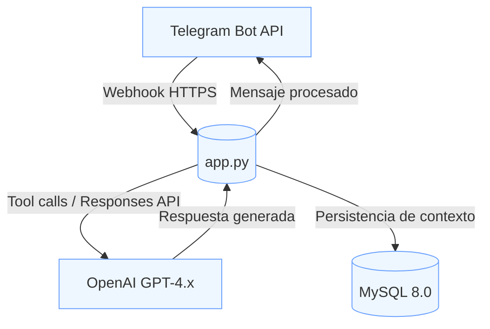

## Si te resulta útil, deja una ⭐ en el repo.
# 🤖 CelesteAI - Bot Inteligente para Telegram

[](https://python.org)
[](https://fastapi.tiangolo.com)
[](https://platform.openai.com/)
[](https://core.telegram.org/bots/api)
[](https://mysql.com)

<div align="center">
  
</div>


> Bot para Telegram impulsado por OpenAI (Responses API), con contexto persistente, herramientas integradas y recordatorios. Proyecto publicado como portafolio técnico.


## 🌟 Funcionalidades Clave

### 🧠 Gestión de Conversaciones
- Contexto persistente entre sesiones (MySQL).
- Soporte multilingüe con detección automática.
- Respuestas contextuales usando modelos GPT-4.x vía Responses API.

### 🛠️ Integración de Herramientas
- Tool calls a través de OpenAI Responses API (ejecución de funciones internas).
- Recordatorios con reglas recurrentes (RRULE).
- Datos en tiempo real (fecha/hora con zona horaria).
- Traducción EN↔ES, incluyendo imágenes (acceso restringido por rol; personalizable).
- Arquitectura extensible con registro de herramientas tipo plugin.

### 🔐 Seguridad
- Autorización por chat/usuario y rol de administrador.
- Saneamiento básico de entradas (formato HTML/Markdown de Telegram).
- Configuración por entorno (.env) para credenciales y secretos.

### 🚀 Despliegue sencillo
- FastAPI asíncrono.
- Webhook para Telegram.
- Listo para Railway (Procfile y railway.json incluidos).

> Nota de alcance: este repo está pensado como ejemplo de arquitectura y buenas prácticas para portafolio. No pretende cubrir HA, colas externas ni operación a gran escala.

## 🏗️ Resumen de la Arquitectura

```
CelesteAI-open/
├── bot/                           # Implementación principal del bot
│   ├── assets/                    # Recursos gráficos
│   ├── core/                      # Componentes esenciales
│   │   ├── config.py              # Gestión de entorno y configuración
│   │   ├── logger.py              # Sistema centralizado de logs
│   │   └── telegram_bot.py        # Inicialización del bot de Telegram
│   ├── db/                        # Capa de base de datos
│   │   └── models.py              # Modelos MySQL y pooling de conexiones
│   ├── handlers/                  # Manejadores de mensajes y eventos
│   │   ├── __init__.py
│   │   ├── auth.py                # Lógica de autenticación/autorización
│   │   ├── handlers.py            # Manejadores generales
│   │   ├── help.py                # Sistema de ayuda
│   │   ├── manejar_mensaje.py     # Procesamiento principal de mensajes
│   │   ├── manejar_nuevos_miembros.py
│   │   ├── manejar_sticker.py
│   │   └── manejar_traduccion.py  # Sistema de traducción
│   ├── routes/                    # Rutas FastAPI
│   │   ├── recordatorios.py       # Programación de recordatorios (RRULE)
│   │   └── webhook.py             # Endpoint webhook de Telegram
│   ├── services/                  # Servicios de dominio
│   │   └── OpenAI/                # Integración con OpenAI (Responses API)
│   │       ├── resources/         # Instrucciones y definiciones
│   │       │   ├── instrucciones.txt
│   │       │   ├── tools.json
│   │       │   └── traducir.txt
│   │       ├── tools/
│   │       │   ├── __init__.py
│   │       │   └── registry.py    # Registro de herramientas (tool calls)
│   │       ├── __init.py
│   │       ├── conversation.py    # Estado conversacional
│   │       ├── openai.py          # Cliente Responses API
│   │       ├── responder.py       # Orquestador de respuestas
│   │       └── utils.py           # Utilidades
│   ├── utils/
│   │   └── image_utils.py         # Procesamiento de imágenes
│   ├── app.py                     # Aplicación FastAPI
│   └── handlers_logic.py          # Lógica de handlers
├── tools/
│   └── funciones.py               # Implementaciones de herramientas externas
├── main.py                        # Punto de entrada
├── Procfile                       # Config Railway
├── railway.json                   # Config de servicio Railway
├── .env.example                   # Plantilla de variables de entorno
├── README.md                      # Este archivo
├── LICENSE                        # Licencia (Apache-2.0)
└── requirements.txt               # Dependencias
```


## 🚀 Inicio Rápido

### Requisitos Previos
- Python 3.8+
- MySQL 8.0+
- Token de Bot de Telegram (crea uno con BotFather)
- Clave API de OpenAI (Responses API)

### 1) Configuración del entorno
```bash
# Clona el repositorio
git clone https://github.com/AuYahyire/CelesteAI-open.git
cd CelesteAI-open

# Crea un entorno virtual
python -m venv venv

# Activa el entorno virtual
# Windows:
venv\Scripts\activate
# Linux/Mac:
source venv/bin/activate

# Instala dependencias
pip install -r requirements.txt
```

### 2) Variables de entorno
Copia la plantilla y edítala con tus credenciales.

Windows:
```bash
copy .env.example .env
```

Linux/Mac:
```bash
cp .env.example .env
```

.env (campos principales):
```env
# Telegram
TOKEN_TELEGRAM=tu_token_de_bot_telegram
BOT_USERNAME=tu_nombre_de_usuario_bot
CHAT_IDS_AUTORIZADOS=[123456789, 987654321]
ADMIN_USER_IDS=[123456789]
ANGLOPARLANTE_USER_IDS=[123456789]

# OpenAI (Responses API)
OPENAI_API_KEY=tu_clave_api_openai
OPENAI_BASE_MODEL=gpt-4.1  # Modelo base (ej.: gpt-4.1, gpt-4o-mini, etc.)

# Base de datos
MYSQLHOST=localhost
MYSQLPORT=3306
MYSQLUSER=tu_usuario_db
MYSQLPASSWORD=tu_contraseña_db
MYSQL_DATABASE=celeste_db

# App
APP_NAME=CelesteAI
PORT=8000
```

### 3) Base de datos
```sql
CREATE DATABASE celeste_db;
```

### 4) Ejecutar la aplicación
```bash
python main.py
```
La aplicación expondrá FastAPI en http://localhost:8000

### 5) Configurar el Webhook de Telegram
Asegúrate de exponer públicamente tu servicio (Railway, o túnel en dev con ngrok/CF Tunnel). El endpoint del webhook está definido en `bot/routes/webhook.py`. Por defecto suele ser algo como `/webhook` (verifica el path exacto en el archivo).

Ejemplo (ajusta URL y path a lo que tengas):
```bash
curl -X POST "https://api.telegram.org/bot$TOKEN_TELEGRAM/setWebhook" \
  -d "url=https://TU-DOMINIO-O-NGROK/webhook"
```

## 🔧 Implementación Técnica (resumen)

### Conversaciones
- Mantenedor de estado conversacional en MySQL.
- Recuperación/guardado de contexto por usuario.

### Tooling (Responses API)
- Definiciones de herramientas en `resources/tools.json`.
- Despachador en `services/OpenAI/tools/registry.py`.
- Orquestación en `services/OpenAI/responder.py`.

### Recordatorios
- Soporte para RRULE (eventos recurrentes).
- Zona horaria configurable (por defecto Caracas; ajustable en código).
- Entrega asíncrona sin bloquear.

### Seguridad
- Autorización multinivel (listas de chats/usuarios permitidos y rol admin).
- Saneamiento básico de HTML/Markdown compatible con Telegram.
- Variables de entorno para secretos.

## 📦 Despliegue

### Railway.app (ejemplo)
`Procfile` y `railway.json` ya están incluidos. Un start típico:
```json
{
  "build": { "builder": "NIXPACKS" },
  "deploy": {
    "startCommand": "python main.py",
    "healthcheckPath": "/",
    "healthcheckTimeout": 100
  }
}
```

> Docker: puedes contenerizarlo si lo necesitas, pero este repo no incluye Dockerfile.

## 📚 Comandos y uso rápido

- /start y /help: inicio y ayuda básica.
- /translate y /traducir: traducción EN↔ES. Soporta texto e imágenes; acceso restringido (admins y usuarios angloparlantes por configuración).
- Conversación general: el bot mantiene contexto entre sesiones.
- Recordatorios: creación y gestión conversacional; soporte de reglas recurrentes.

## ⚖️ Decisiones y alcance

- LLM: OpenAI Responses API (model configurable por variable de entorno).
- Persistencia: MySQL para contexto y datos del bot.
- Transporte: Webhook de Telegram sobre FastAPI.
- Enfoque: simplicidad y claridad arquitectónica para portafolio personal.

## 🧭 Limitaciones conocidas

- No incluye Dockerfile ni orquestación; pensado para despliegues sencillos (Railway, VM, etc.).
- Scheduler y tareas se ejecutan en el proceso de la app; no hay colas externas.
- No orientado a alta disponibilidad ni a carga masiva.
- No hay canal formal de soporte; el repo se publica como referencia de arquitectura.

## 🤝 Contribuir

¡Las contribuciones son bienvenidas! Sin embargo, ten en cuenta las siguientes directrices:

Este bot fue creado originalmente para uso privado y ahora se publica principalmente como ejemplo de buenas prácticas y arquitectura avanzada en Python. **No** está pensado actualmente como un proyecto comunitario con soporte activo o desarrollo continuo. Sin embargo, si crees que debería convertirse en un proyecto colaborativo, siéntete libre de argumentarlo si consideras que merece crecer como proyecto abierto.

- **Pull Requests:**  
  Si quieres aportar un parche, mejora o nueva funcionalidad, puedes enviar un Pull Request. Revisaré los PR cuando sea posible y los fusionaré si cumplen los estándares de calidad y coherencia del proyecto.

- **Issues:**  
  No se ofrece soporte personalizado, y no se garantiza respuesta a incidencias o preguntas. Si encuentras un bug importante, puedes abrir una issue, pero entiende que los tiempos de respuesta o solución no están garantizados. Para mejoras o sugerencias, se prefiere el envío de un PR.

- **Otras formas de contribuir:**  
  Actualmente no se aceptan propuestas vía Wiki, Discussions ni contribuciones a la documentación.

## 🙋 Soporte

Este proyecto lo mantengo como un portafolio personal de buenas prácticas y arquitectura avanzada en Python. No existe un canal formal de soporte.  
Sin embargo, te animo a explorar el código, aprender de él y adaptarlo a tus propios proyectos.

Si te sirve de referencia, considera dejar una ⭐ para apoyar.

## 📄 Licencia

Este proyecto está bajo licencia MIT – consulta el archivo [LICENSE](LICENSE) para más detalles.

## 🔗 Tecnologías Utilizadas

- Backend: Python 3.8+, FastAPI, asyncio  
- IA/ML: OpenAI (Responses API, GPT‑4.x)  
- Base de Datos: MySQL 8.0+  
- Mensajería: Telegram Bot API (webhooks)  
- Despliegue: Railway.app (Nixpacks); Docker opcional (no incluido)  
- Seguridad: Configuración por entorno, saneamiento básico de entradas  
- Monitorización: Logs y healthcheck básicos

---

**Hecho con ❤️ para ayudar a quienes lo necesitan**
